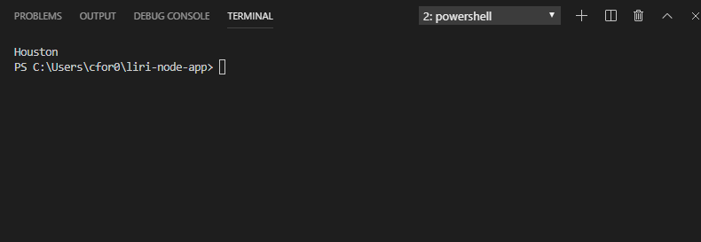

# liri-node-app

## Overview
This app is designed to take the user input (proccess.argv[2]) from the console and output information associated with the(process.argv[3]). Once the data has been retrieved from the API, I grab the first result from the response. These callbacks use `axios` and `spotify` packages.

 

* User input: 
    * concert-this
    * spotify-this-song
    * movie-this
    * do-what-it-says
        

## Built With
* Node
* Javascript
* Axios
* Moment
* node-spotify-api
